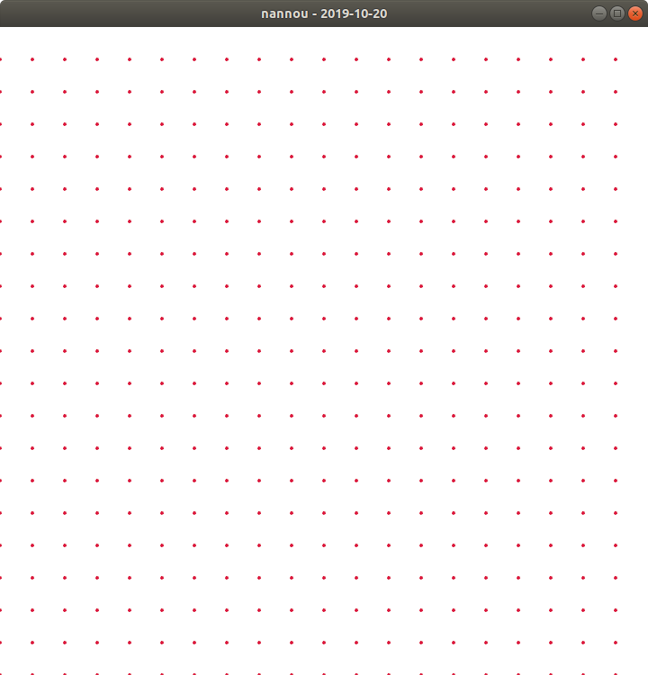

# Daily Nannou Sketch 

Trying to get a weekly subject with super-small daily increment

## Run

Run with:

    $ cargo run --bin 2019-10-20

## Create

1. [•] `cp -r 2019-09-24 2019-CURRENT-DATE`
2. [•] add `2019-CURRENT-DATE` to `Cargo.toml` of workspace

## Screenshots

