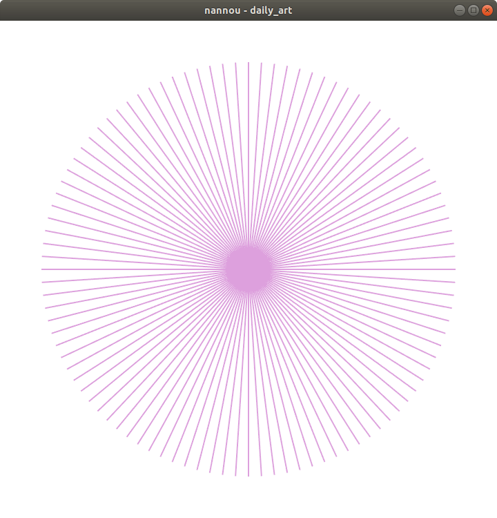
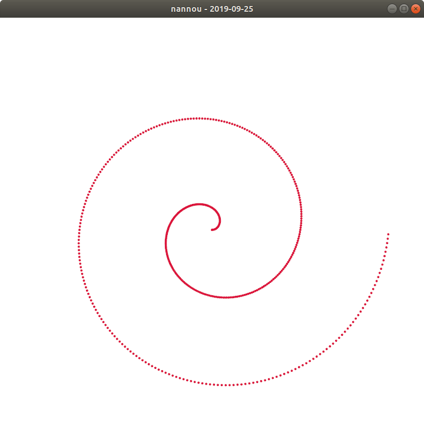

# Daily Nannou Sketch 

Ideas:

- Same as 2019-09-24 but with points that are moving from/to the center

## Run

Run with:

    $ cargo run --bin 2019-09-24

## Create

1. [•] `cp -r 2019-09-24 2019-CURRENT-DATE`
2. [•] add `2019-CURRENT-DATE` to `Cargo.toml` of workspace

## Screenshots

