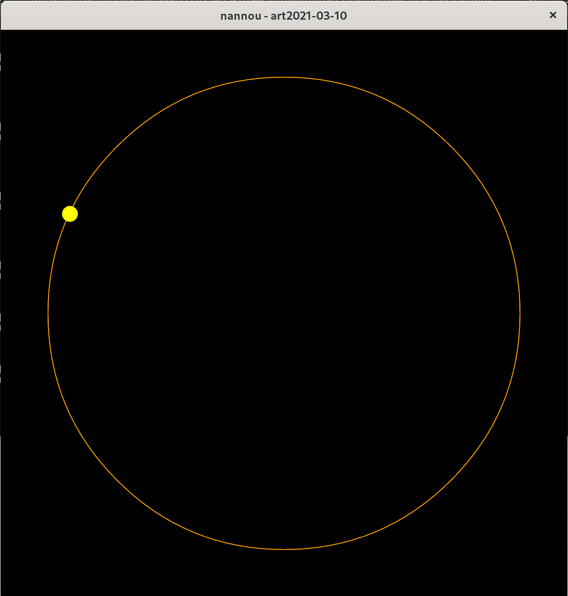

# Daily Nannou Sketch 

Trying to get a weekly subject with super-small daily increment

## Run

Run with:

    $ cargo run --bin 2019-10-20

## Create

1. [•] `cp -r 2021-03-10 2021-CURRENT-DATE`
2. [•] Update the package name to current date in `Cargo.toml`
3. [•] add `2021-CURRENT-DATE` to the cargo workspace.

## Screenshots

